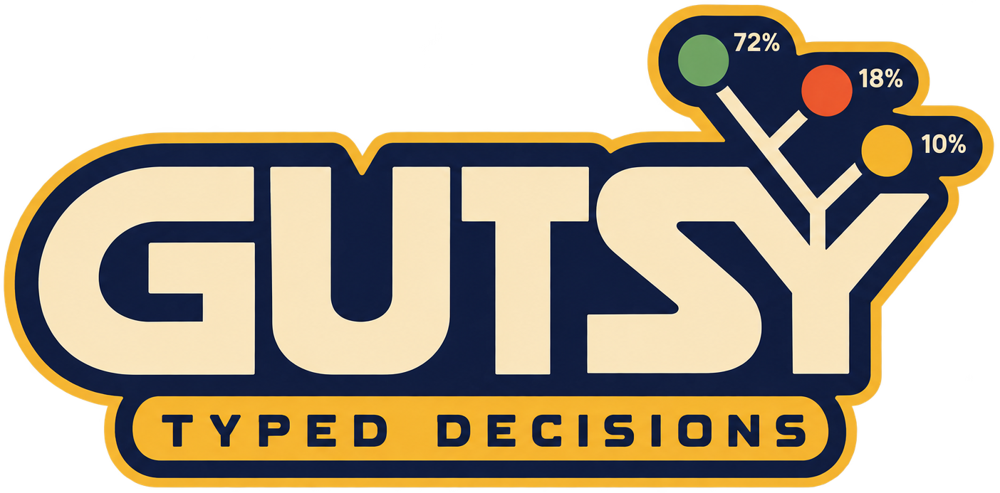
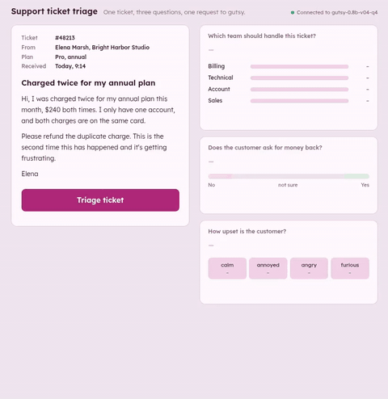
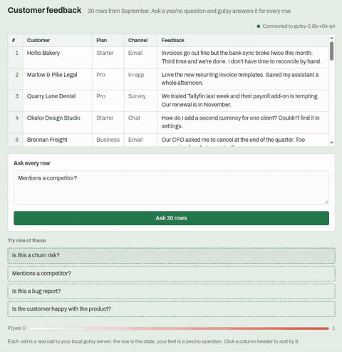
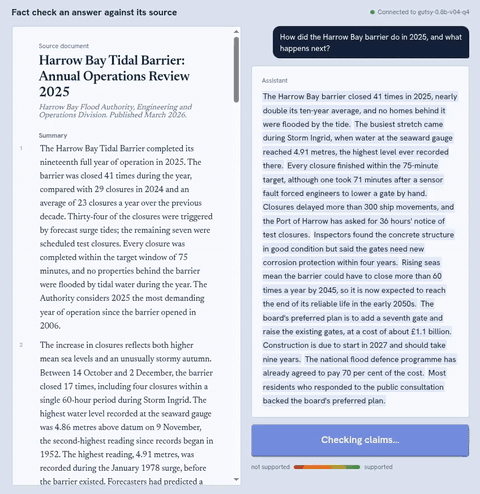
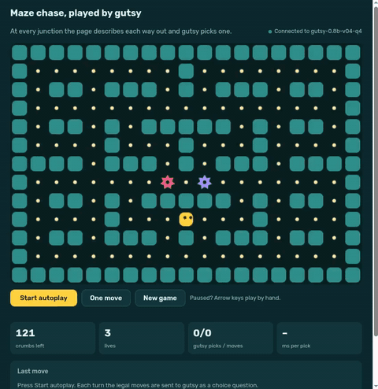

<h1 align="center"></h1>

**Local decision models with calibrated probabilities.** Send a state (text or JSON) and typed
questions (yes/no, choice, score); get a probability for every option back. No text generation, no
network calls, no per-call cost. The API follows the Jev-style Decisions format, so existing clients
mostly need only a new base URL.

| | |
|---|---|
| Model | `gutsy-0.8b` v0.4, a fine-tune of Qwen3.5-0.8B: Q8_0 (775 MB) or Q4_K_M (505 MB, 25-30% faster), on [Hugging Face](https://huggingface.co/kouhxp/gutsy) |
| Runtime | [`gutsy-inference`](gutsy-inference/), llama.cpp on an ordinary CPU |
| Docs | [Model card](MODEL_CARD.md), [release notes](docs/releases/) |
| License | Apache 2.0 |

## Why use it

- **Calibrated.** A 0.8 means roughly 80% (validation calibration error 0.022).
- **Local and private.** Runs on CPU; your data never leaves the machine.
- **Deterministic.** Same request, same probabilities, on the same machine and build.
- **Robust to option order.** 96-97% of answers are unchanged when options are shuffled.
- **Cheap follow-ups.** The state is encoded once; each extra question costs only its own tokens.
- **Up to 255 options**, and a `reject` probability for "none of these fits".

## Quickstart

```bash
git clone https://github.com/kouhxp/gutsy
pip install -e gutsy/gutsy-inference           # needs llama-cpp-python >= 0.3.35
pip install -U huggingface_hub
hf download kouhxp/gutsy --include "gutsy-0.8b-v04*" --local-dir gutsy/gutsy-inference/models
cd gutsy/gutsy-inference
cp models.example.json models.json
gutsy-inference check                   # expect "caching OK" for both models
gutsy-inference serve                   # http://127.0.0.1:8765
```

```bash
curl -s http://127.0.0.1:8765/v1/systemone -H 'Content-Type: application/json' -d '{
  "state": "Order 1182 shipped Monday. The customer says it arrived Thursday with the box crushed.",
  "questions": {"decision": {"type": "choice", "instructions": "What should support do next?",
    "criteria": {"refund": "issue a refund", "replace": "send a replacement",
                 "escalate": "a manager reviews it within 24 hours"}}}}'
```

The default model is Q8_0; send `"model": "gutsy-0.8b-v04-q4"` for the smaller file. Choice and
score answers also return `confidence`, `margin` and `reject`. Endpoints, question types and how
to set thresholds are in the [runtime README](gutsy-inference/README.md).

## Browser demos

Start the server with `gutsy-inference serve --cors` and open any file in
[gutsy-inference/examples](gutsy-inference/examples/). The data is made up; every probability comes
from your local model.

| [Support triage](gutsy-inference/examples/support-triage.html) | [Feedback sheet](gutsy-inference/examples/feedback-sheet.html) | [Model router](gutsy-inference/examples/model-router.html) |
|---|---|---|
| <br>Team, refund and mood for one ticket | <br>Ask any yes/no question of 30 rows | <br>Pick the cheapest model per message |
| **[Fact check](gutsy-inference/examples/fact-check.html)** | **[Call radar](gutsy-inference/examples/call-radar.html)** | **[Maze autoplay](gutsy-inference/examples/maze-autoplay.html)** |
| <br>Score each claim against a source | <br>Live triggers on a sales call | <br>gutsy plays a maze chase |

`--cors` lets any page you visit query the server, so leave it off when you're not using the demos.

## Results

All gutsy numbers are ours, on public items; scores are accuracy. Other systems' numbers come from
the sources noted and may use different samples, so treat comparisons as indicative.

**gutsy vs Laya vs Jev**

| | gutsy Q8_0 | Laya | Jev |
|---|---|---|---|
| JevBench public items (231) | 0.732 | 0.537 | 0.866 |
| BANKING77, zero-shot over all 77 intents | 0.613 | 0.382 | 0.764 |

JevBench: fine-tuned Laya and Jev as reported by other projects on the same public set; official
JevBench results use sealed items. BANKING77: gutsy on the full test split; Laya and Jev from
[dhruvmehra/jevbench](https://github.com/dhruvmehra/jevbench) on a 500-item sample of it.

**JevBench by tier**

| | Q8_0 | Q4_K_M |
|---|---|---|
| Easy (48) | 48 | 47 |
| Original (72) | 65 | 62 |
| Hard (111) | 56 | 52 |
| **Total** | **0.732** | **0.697** |

**Benchmarks**

| | gutsy Q8_0 | gutsy Q4_K_M | Jev |
|---|---|---|---|
| Financial PhraseBank | 0.927 | 0.926 | 0.770 |
| RAGTruth * | 0.813 | 0.807 | 0.773 |
| WinoGrande * | 0.620 | 0.629 | 0.907 |
| JudgeBench | 0.539 | 0.563 | 0.786 |
| BBH | 0.481 | 0.474 | 0.943 |

\* Training splits of these were in the training data (test items never were). Jev figures are from the
Jeff-0.8B project's README, on a different sample of these benchmarks.

Measured by us on the same 700 items per task:

| | gutsy Q8_0 | Jev (via API) |
|---|---|---|
| BoolQ | 0.837 | 0.906 |
| SNLI | 0.870 | 0.883 |
| CommonsenseQA (not trained on) | 0.577 | 0.863 |

Also: lists of 20-254 options 0.991; abstains when a missing fact decides the answer 0.896.

## Where it is weak

Test on your own data before automating any of these:

- **Date and number arithmetic** is near chance. Compute in code and ask about the result.
- **New multi-step rulebooks** (JevBench long_policy 0.32).
- **Ambiguity:** still hedges in about a third of cases where the rules already settle it.
- **Judging close pairs of answers** and **world knowledge** (see JudgeBench and CommonsenseQA).
- **Calibration on hard, unfamiliar items** (error 0.137, vs 0.022 on validation).
- **Long states on CPU:** median 4.3 s, 95th percentile 27 s on JevBench's hard tier (Q8_0).
- English only.

## Training

Full fine-tune of Qwen3.5-0.8B on about 105,000 questions (one epoch, one 80 GB GPU, about an hour),
with cross-entropy plus Brier loss on soft labels. A third of the data is scenarios written by an
open teacher model (Qwen3.8-27B) and kept only when two independent passes agreed; the rest is
public datasets (reading, classification, routing, judging, contracts) and code-generated puzzles
with exact labels. The build fails if any question template's answer can be predicted from surface
features such as option length or position. Details and sources: [MODEL_CARD.md](MODEL_CARD.md).

## Disclosures

- No closed-model output is used anywhere in the training data.
- Some puzzles target known weak spots on BBH and JevBench families, but no BBH or JevBench item,
  template or wording was used, and training data was decontaminated against JevBench and the
  evaluation panel.
- In-domain data: RAGTruth, WinoGrande, CLINC150 and MASSIVE training splits. BANKING77 is held out,
  so the comparison above is zero-shot for all three systems.
- No official JevBench result yet.

## License

Code and weights: Apache 2.0, as are the base and teacher models. The training data uses CC BY 4.0,
CC BY-SA, CC0, MIT and Apache 2.0 sources, credited in MODEL_CARD.md (Jev Decisions v1 is CC BY 4.0
with upstream NVIDIA terms); redistributing the data itself means following each source's terms.
